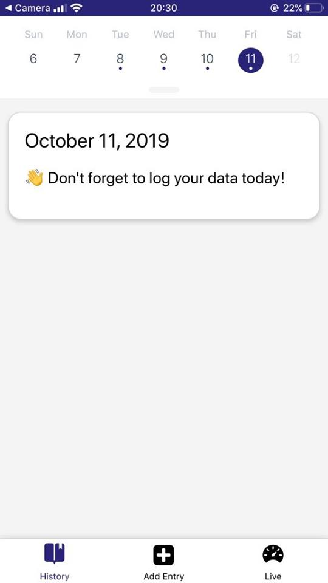
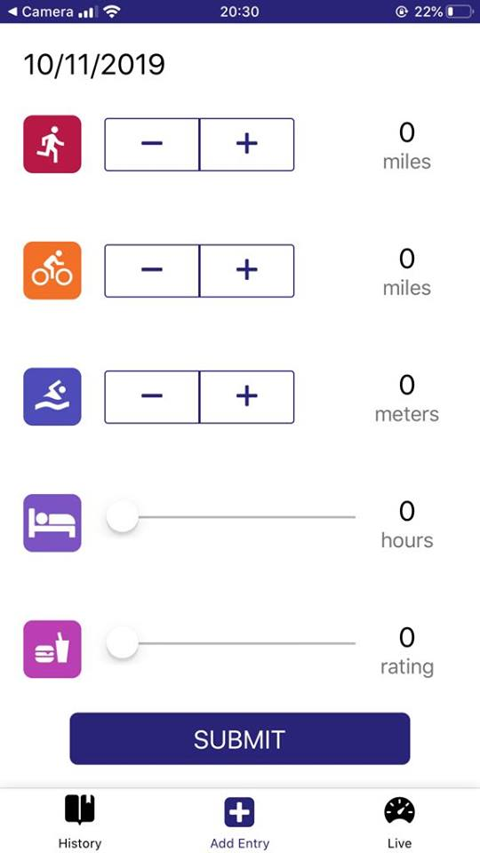
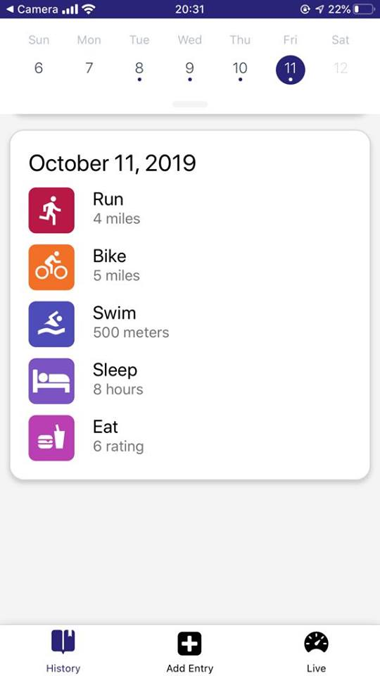

# Fitness App

Fitness App is a Triathlon Tracking App for iOS and Android built with React Native.
Allows users to track Run, Bike, Swim, Sleep, & Eat categories on a daily basis, Provides activity history and notification reminders, Uses Geolocation to track direction, speed, & altitude

It uses Geolocation and allows users to track activity in following categories:

- Run
- Bike
- Swim
- Sleep
- Eat

## Live screenshots from the app.
  

## Installation

Clone the repository, change directories, and use npm or yarn to install the dependencies.

```bash
$ git clone https://github.com/mohamedsgap/fitness-app.git
$ cd fitness-app
$ yarn
```

## Usage

The project can be run with npm or yarn

- `yarn start`

This will open Expo Developer Tools in the browser.  You can then do one of the following.

- Use your device to test:

    Scan the QR Code using the Expo Client app ([Expo Client for Android & iOS](https://expo.io/tools#client))  from an Android or iOS device.
- Use an Android Emulator or iOS Simulator to run the app:
    - [iOS Simulator Setup](https://docs.expo.io/versions/v33.0.0/introduction/installation/#ios-simulator)
    - [Android Emulator Setup](https://docs.expo.io/versions/v33.0.0/introduction/installation/#android-emulator)

## Testing

This project has been tested on the following platforms:

- iOS 12+
- Android 9+.


